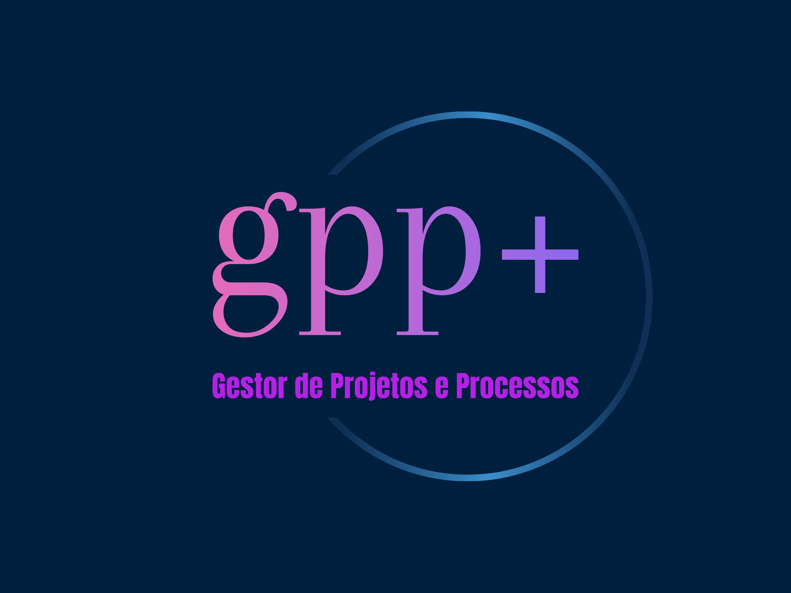

  
  
  
  
  
  
  

<h1 align="center">
    
</h1>

  • <a href="#-sobre-o-projeto">Sobre</a>
  • <a href="#-funcionalidades">Funcionalidades</a>
  • <a href="#-desenvolvedor">Desenvolvedor</a>
  • <a href="#-como-contribuir-para-o-projeto">Contribuições</a> 
  • <a href="#-copyright">Copyright</a> •

  

<h4 align="center"> 
	 ⏯ GPP+ 🚧️ Em construção ⚠️  
</h4>

---

## 💻 Sobre o projeto 

⏯️ GPP+ é um gestor de projetos e processos, com funções de gerenciamentos e controles de rotinas, mais alguns adicionais úteis ao contexto

Projeto desenvolvido durante a disciplina de **Projeto em Engenharia de Computação** ofertada pelo [IFPB - Campina Grande](https://www.ifpb.edu.br/campinagrande).
A disciplina faz parte dos 9º e 10º semestre da grade currícular do curso de Engenharia de Computação do IFPB - Campina Grande e tem como responsáveis os professores [Dr. Fagner de Araujo Pereira](http://lattes.cnpq.br/8972233136339551) e o [Dr. George Sobral Silveira](http://lattes.cnpq.br/2934289095298260).

---

## ⚙️ Funcionalidades

- [ ] Back-end
    - [ ] Notion - API
    - [ ] Notion - Banco de dados
    - [ ] CRUD
- [ ] Front-end
    - [ ] Figma - Layout
    - [ ] Figma - Protótipo
    - [ ] Landing page
    - [ ] Site
- [ ] Testes
  - [ ] Unitários
  - [ ] Sistema

---

## 👨‍💻 Desenvolvedor

<table>
  <tr>
    <td align="center"><a href="https://github.com/JardelBrandon"> <b>Jardel Brandon</b></a> <a href="https://github.com/JardelBrandon" title="Jardel">👨‍🚀</a></td>
  </tr>
</table>

---

## 💪 Como contribuir para o projeto

1. Faça um **fork** do projeto.
2. Crie uma nova branch com as suas alterações: `git checkout -b my-feature`
3. Salve as alterações e crie uma mensagem de commit contando o que você fez: `git commit -m "feature: My new feature"`
4. Envie as suas alterações: `git push origin my-feature`

---

## 📝 Copyright

Este projeto está sobe licença própria e pode ser acessada no seguinte [Arquivo](./LICENSE.txt).

---