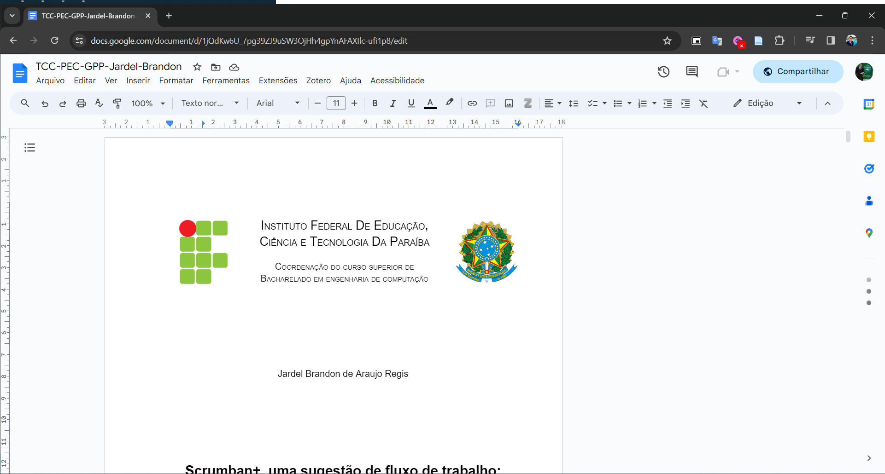

<h1 align="center">Monografia</h1>

<table>
    <tr>
        <th> LaTeX </th>
        <th> Docx </th>
    </tr>
    <tr>
        <td>
            

                <a href="https://www.overleaf.com/read/kvycdgpdwvnj#712446">Overleaf</a>
                
            

        </td>
        <td>
            

                <a href="https://docs.google.com/document/d/1-vLWGNss1059ts8C5RuzVsjsw5uCy65NIsVyKOmZZps/edit?usp=sharing">Google Docs</a>
                
            

        </td>
    </tr>
</table>